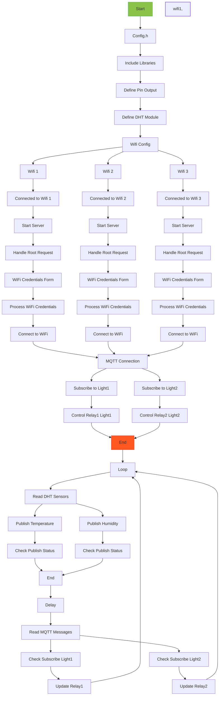

# IoT Sensor Data Publisher with Multi-WiFi and MQTT

This Arduino project demonstrates an ESP8266-based IoT sensor data publisher. It reads temperature and humidity data from a DHT11 sensor and light control signals from Adafruit IO MQTT broker. The code supports multi-WiFi configuration with fallback and robust MQTT connection.

## Hardware Requirements

- ESP8266-based board (e.g., NodeMCU, Wemos D1 Mini, etc.)
- DHT11 temperature and humidity sensor
- Two-channel relay module

## Configuration

### config.h

This header file contains the necessary configurations for WiFi and Adafruit IO MQTT. Update the following parameters to match your setup:

- `Relay1`: The GPIO pin connected to the first relay (Light1).
- `Relay2`: The GPIO pin connected to the second relay (Light2).
- `DHTPIN`: The GPIO pin connected to the DHT11 sensor.
- `DHTTYPE`: The DHT sensor type (DHT11 in this case).
- `ssid1`, `password1`: WiFi credentials for the first network.
- `ssid2`, `password2`: WiFi credentials for the second network.
- `ssid3`, `password3`: WiFi credentials for the third network.
- `AIO_SERVER`: The Adafruit IO MQTT broker server.
- `AIO_SERVERPORT`: The MQTT broker port (use 8883 for SSL).
- `AIO_USERNAME`: Your Adafruit IO username.
- `AIO_KEY`: Your Adafruit IO secret key.

### main.ino

The main Arduino sketch sets up the connections, subscribes to Adafruit IO feeds for relay control, and publishes temperature and humidity data to corresponding feeds on Adafruit IO.

## Usage

1. Update the configurations in `config.h`.
2. Connect the relay module and DHT11 sensor to the appropriate GPIO pins on the ESP8266 board.
3. Upload the code to your ESP8266 board using the Arduino IDE or compatible software.
4. The ESP8266 board will attempt to connect to the available WiFi networks in the order defined in `wifi_multi.addAP()`. If one WiFi fails, it will try the next one, ensuring a reliable connection.
5. Once connected to WiFi and Adafruit IO MQTT broker, it will subscribe to the specified feeds for relay control.
6. The board will publish temperature and humidity data to the corresponding feeds on Adafruit IO.
7. Monitor and control the relay outputs remotely through Adafruit IO.

## flowchart

## Note

- Ensure you have a stable internet connection and access to the Adafruit IO server for MQTT communication.
- Double-check hardware connections and GPIO pin assignments to avoid any issues.

## Support

You can support me by buy me a coffee if u like to.

<!--   <h4>And you can also support me by <a href="https://www.buymeacoffee.com/azzar" target="_blank">buying me coffee</a></h4> -->
  

## Credits

This project uses the following libraries:

- [ESP8266WiFi](https://arduino-esp8266.readthedocs.io/en/latest/esp8266wifi/readme.html)
- [ESP8266WiFiMulti](https://github.com/esp8266/Arduino/tree/master/libraries/ESP8266WiFi/src)
- [Adafruit_MQTT](https://github.com/adafruit/Adafruit_MQTT_Library)
- [Adafruit_MQTT_Client](https://github.com/adafruit/Adafruit_MQTT_Library)
- [DHT](https://github.com/adafruit/DHT-sensor-library)
